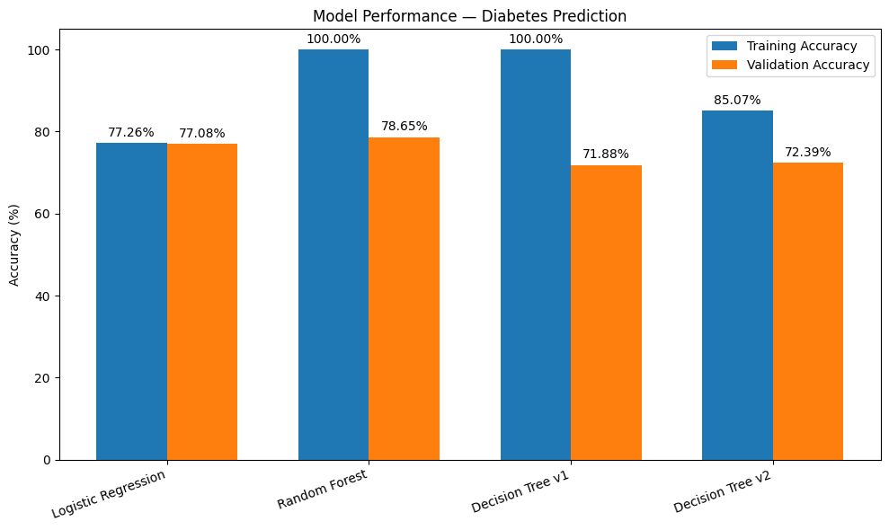

# 🍬 Medical Diagnosis ML — Diabetes Prediction

## 📖 Overview
This repository contains a machine learning project focused on **Diabetes Disease Prediction**.  
The goal is to build and evaluate models that can predict the likelihood of diabetes based on patient medical records (Pima Indians Diabetes dataset).

The workflow includes:
- **Data Exploration (EDA):** Analyze feature distributions, handle missing-like values (e.g., zeros).
- **Model Training & Comparison:** Logistic Regression, Random Forest, and Decision Tree models.
- **Explainability (XAI):** Interpret predictions with SHAP and LIME.
- **Reporting:** Summarize results with metrics and plots.

---

## 📊 Model Performance Summary
The models were trained on the diabetes dataset. Some models showed signs of overfitting, while others achieved more balanced results.

| Model                   | Training Accuracy | Validation Accuracy | Notes                                   |
|--------------------------|------------------|---------------------|-----------------------------------------|
| Logistic Regression      | –                | 77.08% – 77.26%     | Decent baseline model.                  |
| Random Forest Classifier | 100.00%          | 78.65%              | High variance, possible overfitting.    |
| Decision Tree (v1)       | 100.00%          | 71.88%              | Severe overfitting.                     |
| Decision Tree (v2)       | 85.07%           | 72.39%              | More balanced, still lower validation.  |

> ⚠️ Random Forest and Decision Tree achieved **100% training accuracy**, but their validation accuracy dropped significantly, indicating **overfitting**.

---
## Here the Bar plot comparing traning vs validation accuracy side by side

---

## 📌 Key Highlights
- Built ML models for predicting diabetes risk.  
- Logistic Regression achieved stable ~77% accuracy.  
- Random Forest showed strong training fit but moderate generalization (78.65%).  
- Decision Tree experiments highlighted overfitting risks, validating the importance of cross-validation.  
- Integrated explainability tools (SHAP/LIME) for model interpretation.  
